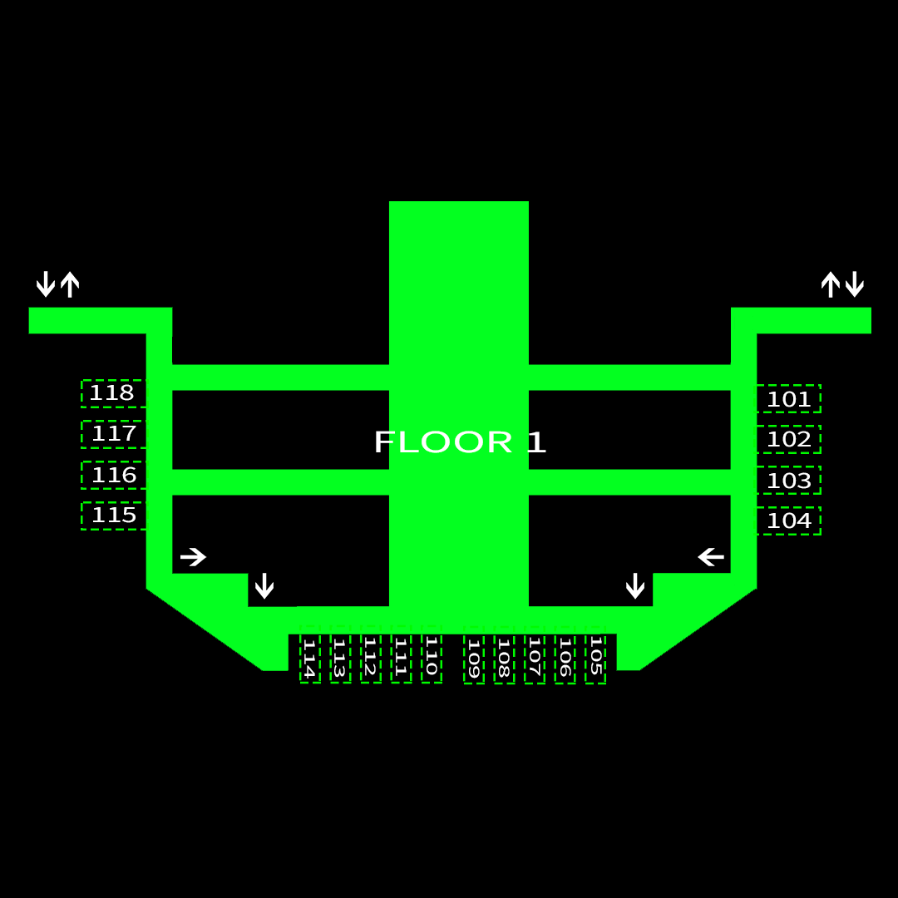
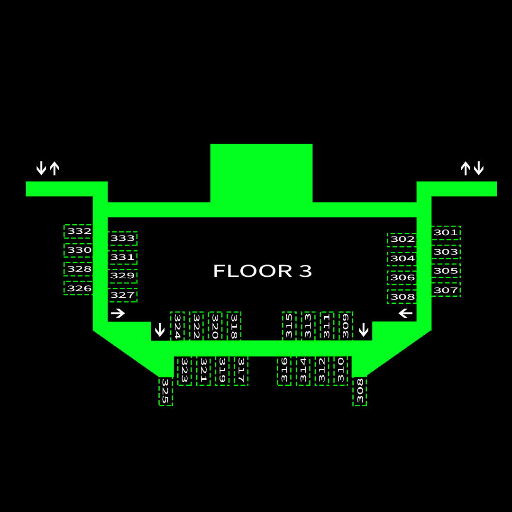
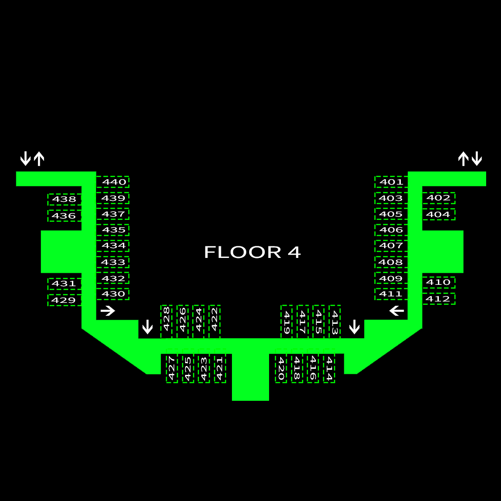
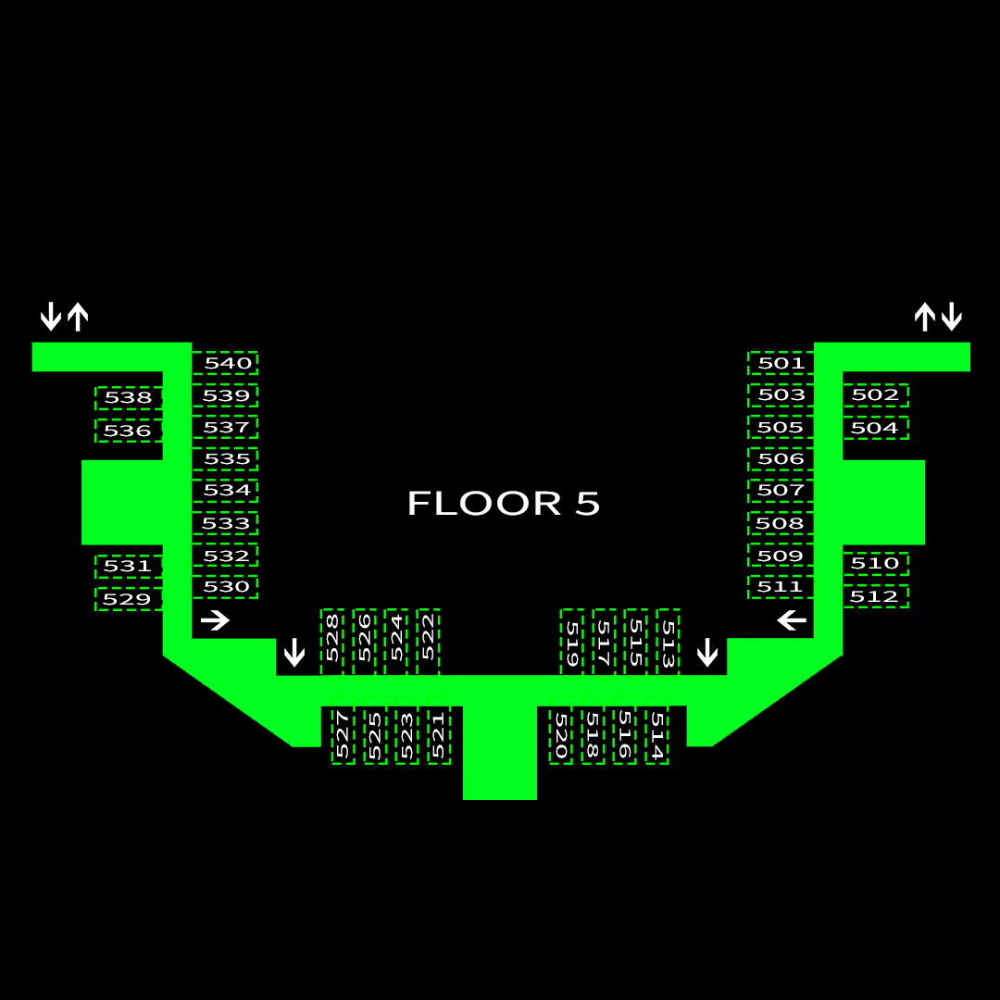

# Places of interest

1. Community Center - The place where some indoor games like **badminton** are played. **Yoga** is also done here.
2. Shopping Complex - The place to buy all of your life's needs, except for the things you actually need. Tasty **paneer paratha's** can be found here.
3. Restaurant - The Veg Crispy Rolls are the **best**
4. Health Center - Apparently the _place_ to get medicines
5. Old Library - No books are left here, only their **ghosts**
6. Central Analytical Facility - **Nobody** knows what happens here, except that the board has an unfortunate typo.
7. Lecture Hall Complex - You _know_ what this is.
8. Admin - Important people like the security guard who **protects** the admin building sit here.
9. Library - There is good AC here. Nothing else of any real interest
10. AB 1 and 2 - The scientific grounds of IISER Mohali. There's a _Quantum Computer_ here... eventually there will be one hopefully.
11. Hostels - There are actually only 4 hostels. But there are supposed to be 8. Where did the other 4 go? Well, much like **elliptical curves**, there are some things which we cannot understand.

$\pagebreak$

# Hostel Map

{ width=50% }
{ width=50% }

{ width=50% }
{ width=50% }

{ width=50% }
{ width=50% }

{ width=50% }
{ width=50% }

