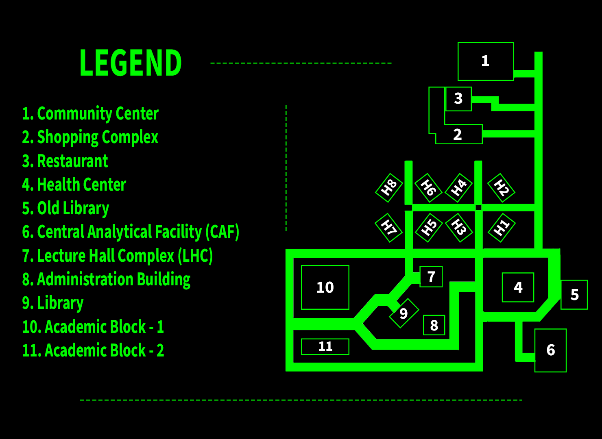

# How to run the game

1. Download the game from the game website at [https://iiserm.github.io/GTA-Stress-City](https://iiserm.github.io/GTA-Stress-City) for your operating system.
2. Run the game
  1. For windows, simply double click the downloaded file
  2. For linux, right click the file and check the box "Allow this file to be executed", or equivalent. Alternatively, run `chmod +x filename` on the file.
3. The game will handle the rest. It may ask you to install a font.
4. Enjoy!

**Feel free to ask any questions if you have**

## Mac

We really tried to get it to work on Mac, but due to technical issues out of our hands, we were not able to. There will still be a built executable that you can run.

# Places of interest

1. Community Center - The place where some indoor games like **badminton** are played. **Yoga** is also done here.
2. Shopping Complex - The place to buy all of your life's needs, except for the things you actually need. Tasty **paneer paratha's** can be found here.
3. Restaurant - The Veg Crispy Rolls are the **best**
4. Health Center - Apparently the _place_ to get medicines
5. Old Library - No books are left here, only their **ghosts**
6. Central Analytical Facility - **Nobody** knows what happens here, except that the board has an unfortunate typo.
7. Lecture Hall Complex - You _know_ what this is.
8. Admin - Important people like the security guard who **protects** the admin building sit here.
9. Library - There is good AC here. Nothing else of any real interest
10. AB 1 and 2 - The scientific grounds of IISER Mohali. There's a _Quantum Computer_ here... eventually there will be one hopefully.
11. Hostels - There are actually only 4 hostels. But there are supposed to be 8. Where did the other 4 go? Well, much like **elliptical curves**, there are some things which we cannot understand.

$\pagebreak$

# Hostel Map

{ width=50% }
{ width=50% }

{ width=50% }
{ width=50% }

{ width=50% }
{ width=50% }

{ width=50% }
{ width=50% }

